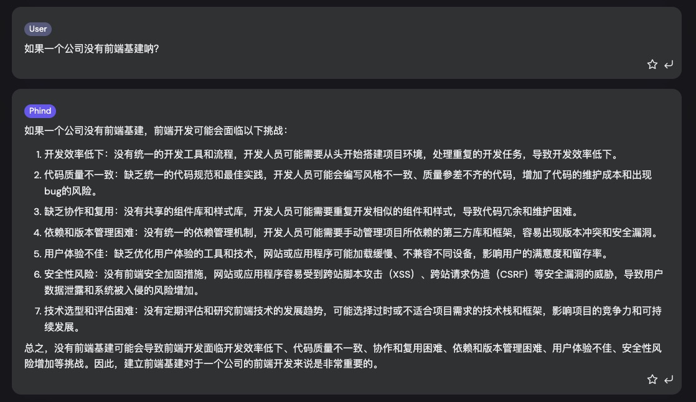
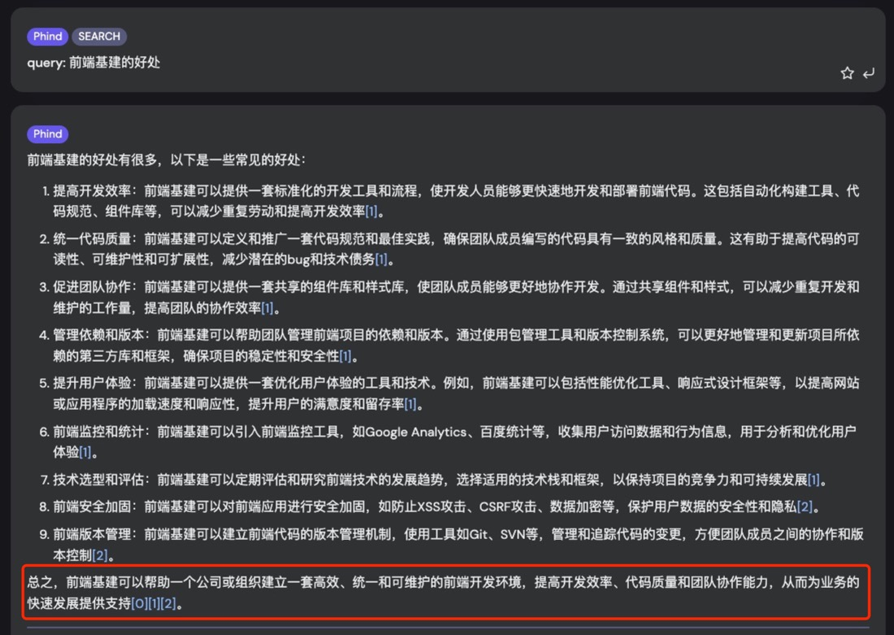
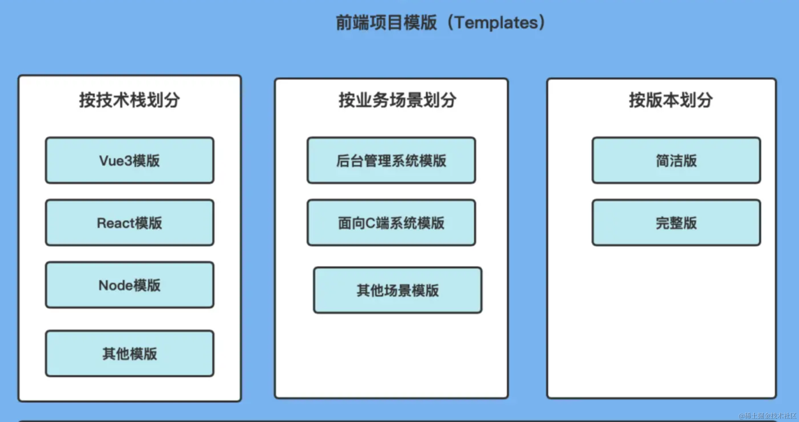
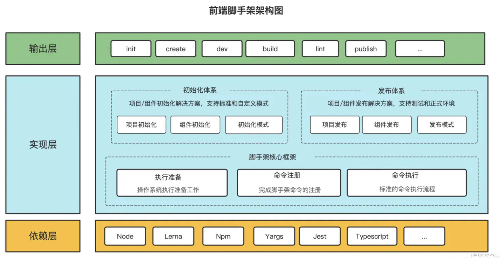
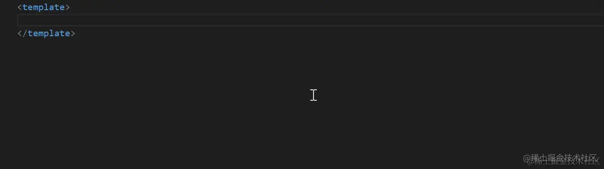
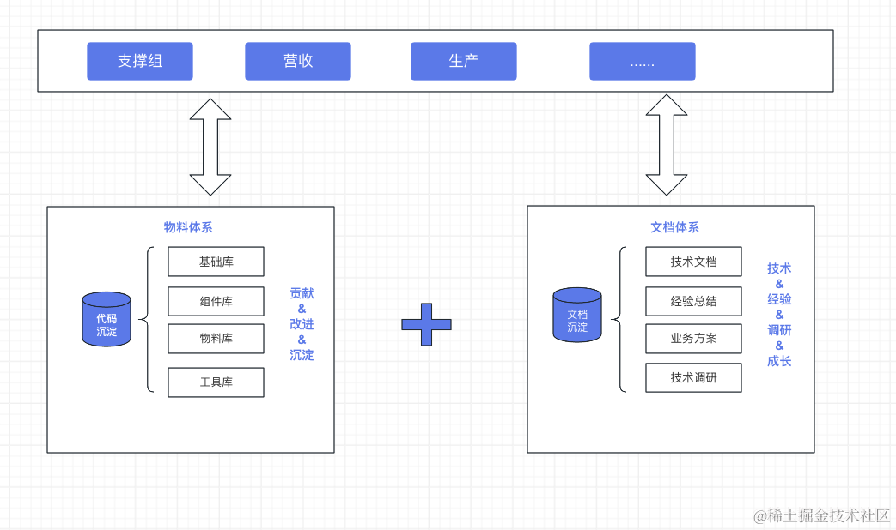
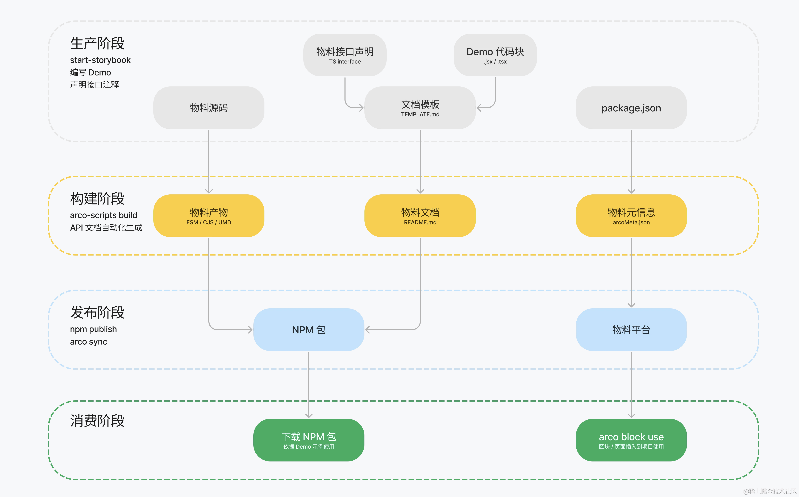
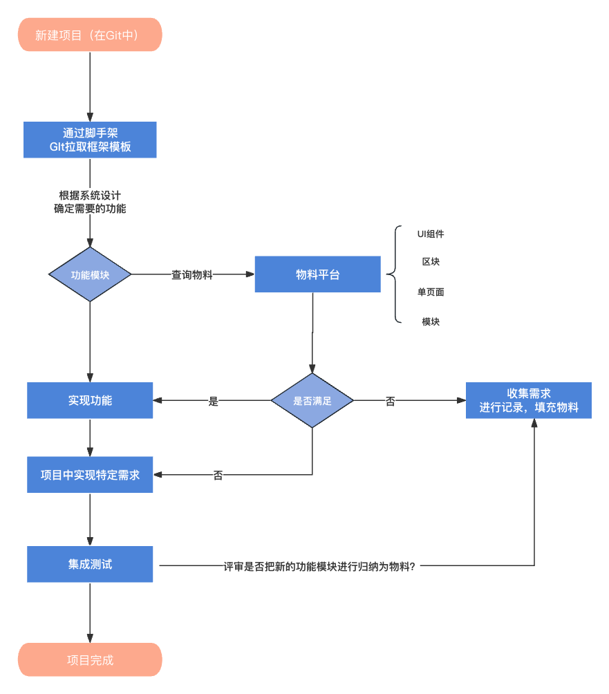
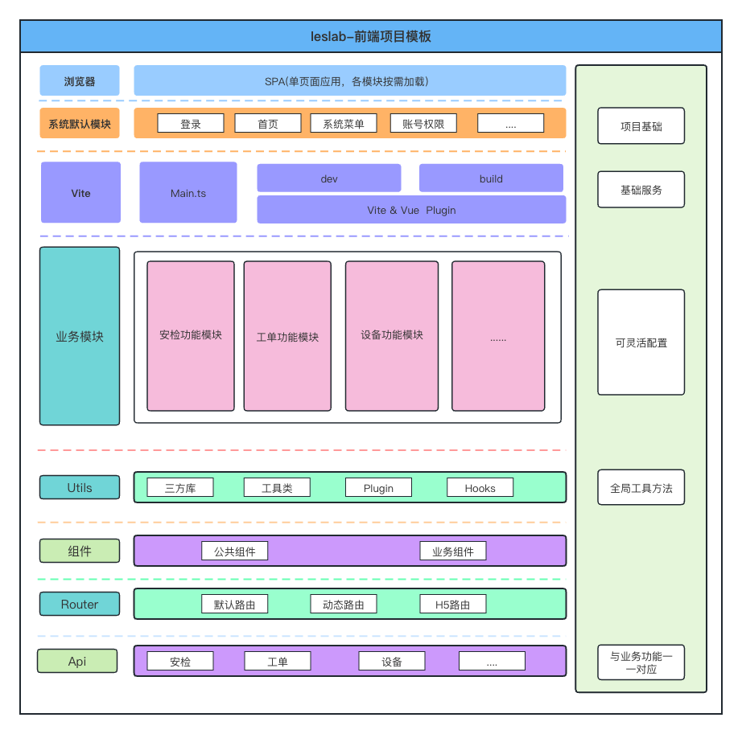
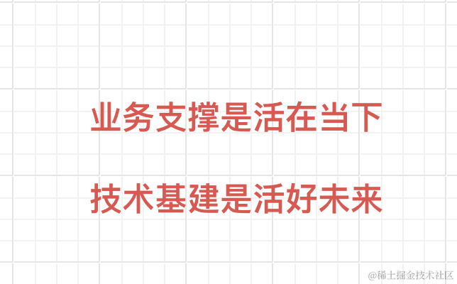

> 注：本文可能只有部分观点是正确的，但是也不妨一读,如果你有更好的想法或建议，希望你的见解一针见血！

## 一、前言

我们先从前端聊起，一般前端开发决定了用户在使用网站或应用程序时的体验。一个好的前端设计可以提供流畅、直观和吸引人的用户界面，使客户更加愿意为之付费（满足客户业务的前提下） 前端可以说是距离客户最近的一方，它也不仅仅是网站或应用程序的外观，它还直接影响用户体验和业务的成功。所以前端的重要程度并不比后端差，尤其是在当今的环境下。

## 二、概括

根据我的了解，公司的前端在之前是非常匮乏的。直到今年公司关于前端专业方向的人员逐渐多了起来（大家也都在持续学习前端的知识），由此可见，公司也是在逐渐把前端正视起来！但是光有前端人员是不够的，我们需要一套完整的前端流程，所以今天想聊一下 前端基建,希望大家多多参与

这里先说一下，我们现在的前端开发模式持续了很多年了，那么我为什么还想要去说这个前端基建？

首先，如果一个软件开发团队没有前端基建都会遇到什么问题？（下图为GPT的回答）

从上述结果可以看到，我们可能中了几招。

再看一下，前端基建的好处？（下图为GPT的回答）

那我们如何去做好前端基建那？很显然，我们需要知道一个成熟的`前端基础建设`是什么样子的。其实呢？没有一个明确的标准，而且公司业务不同，前端的技术栈，基建等都会不同。这里我们需要结合我们公司现有的一些产品去做基建。

## 三、前端基建

先来看一组结合我们目前现状所构想出来的图表：

### 规范层

设计层包含：**设计规范、代码规范、开发流程规范、文档规范**

一个冰箱、洗衣机都会有说明书，说明书就是产品的一部分，一个软件也是。 CHANGELOG（更新日志） 和 README（记叙） 就是一个软件的说明书，它们分别记录了一个软件的打开、使用方式，以及其至今为止的生命周期中经历过什么。 软件应该和冰箱洗衣机一样，不作 “下一个维护” 的假设。

**设计规范：**：主要是起到一致性、设计规范可以确保开发团队在整个项目中采用一致的设计风格和方法。这可以确保整个软件系统的外观、功能和用户体验是一致的！给人的感觉就是合理、干净、整洁。并且可维护性会很高！减少出现错误的风险。也会带来品质保证，大家通过遵循设计规范，可以提高软件的品质和稳定性！ 设计规范包含：布局、栅格、色彩、字体、图标、内容策略、数据可视化、动效等做了一套完整的基础规范，对中后台系统会按照该规范实施开发，减少了设计成本！

**代码规范：** 这个是重中之重！目前看来，代码规范目前只是刚刚推起，还需要沉淀。这方面我们也讨论了很多次了，这里简单概述来说，就是为了可读性、可维护性、减少错误、保证产品的品质、减少技术债（快速开发容易形成技术债）、提高协作

**开发流程规范：** 流程规范可以提高项目管理和控制和质量保证、可以提高效率！目前我们也在使用 功能分支的方式进行项目管理

**文档规范：** 协作开发的方式，文档显得尤为重要！ 甚至我认为比代码规范还要重要，想要开发出来一个款好产品，就要先写好文档。

文档规范可以帮助我们解决什么问题？

1. **知识输出：** 文档可以记录工作中的经验和知识，可以帮助其他同事（或新同事）快速了解项目背景和技术细节！
2. **沟通效率：** 清晰的文档可以准确传达信息，避免信息传递中的偏差和误解，提高大家的沟通效率！
3. **项目管理：** 文档记录了项目的进展、需求和计划，有助于项目管理和进度控制，避免项目过程中出现混乱和延误！
4. **问题追溯：** 文档可以帮助快速定位和解决问题，特别是在项目出现故障时，有清晰的文档能够加快故障排查和修复的速度。
5. 有一个好的文档，也可以更好的体现出，我们团队的专业性和严谨性！

以上这些点，大家可以参考目前最新的 安检系统。
  
### 工具层

**脚手架：**  身为前端开发人员，脚手架肯定十分熟悉，通过像Vue、React、Nuxt、Next这些官方的脚手架，我们可以很轻松的建议有意义最基础的前端项目代码（一行代码、然后选配置既可以）但是随着我们业务的迭代、业务场景的频繁切换，我们可能需要在这些基础的模板中进行长久的沉淀。

下面是一些场景的模板：

> 前端脚手架

上面，我们讲了前端项目模版，那如何更好的去管理模版呢？答案就是脚手架，假如没有脚手架，我们很可能是直接将模版代码放在一个单独的仓库中，每次开启一个新项目，就clone到本地，然后在copy一份出来，这样虽然也可以做，但是脚手架可以通过命令更好更快捷的帮助我们去管理项目模版，以及进行项目初始化等等操作。

脚手架的技术栈和传统的前端项目的技术栈有所不同，上面图中也有说到，底层依赖`Node`，`Lerna`,`Yargs`等

说的通俗一点，就是我们直接用pnpm或者npm 命令直接去生成我们前端框架的模块，然后把各个模块的功能加进去就可以使用了。

**GUI工具:** 和**代码检测工具** 目前我们没有涉及，等之后其他体系成熟了，可以在说。

### 基础层

包含UI库、图表库、Utils库、Snippet库。

- **UI库**
是公司最核心的基础库，目前我们还没有，我们只是使用了一些有名的开源库（Element-Plus、Avue、Ant）, 后续推荐基于`公司设计规范`在`Element-plus`基础上做的二次开发，这些是物料库、业务组件、模板库、解决方案的基础。

- **图表库**
我们主要对Echarts进行二次封装，主要是解决我们一些业务需求，把一些使用率比较高的图表进行封装，组成一个图表库，我们之间通过命令行去引用，会极大的提高我们的开发效率。

- **Utils库**
这里我推荐使用`LodasJS`还有现在安检项目里面封装好的`Utils`和`Hooks`。

- **Snippet库**
把常见的代码片段，封装成全局代码片段，说白了，就是减少你复杂粘贴。
Snippet库 效果：

### 业务层

业务层在`物料平台`上服务于前端技术团队，帮助我们增强团队协作、促进资源共享以及提升开发效率。它基于来自UI组件库的技术积累，提供简单易学的物料开发方案。

在中后台项目开发中，我们通常会使用UI组件库来提高开发效率。基础的UI组件库大大降低了界面开发的成本，但通常这些组件是一些与业务逻辑无关的基本组件，无法满足复杂的业务需求。

在实际项目中，我们经常会遇到可以重复使用的、与业务逻辑紧密耦合的模块，例如安检通用表单、通用的系统导航栏等等。那么，如何在团队内部最大程度地重用这些基本业务模块，以提高效率并降低重复工作呢？这就是物料的概念的出发点。物料的思想是将这些基本业务模块从项目中抽离出来，进行统一维护和管理，将它们称为 `"物料"`。

物料平台主要包含以下四种组成部分：

1. **业务组件：** 这些组件是紧密与业务相关的，是在UI组件库的基础上开发的，如安检通用表单。
2. **区块：** 区块比组件更为复杂，可以理解为多个组件的集合。一个页面通常由多个区块组成，开发者可以将区块添加到自己的页面中以进行二次开发。由于区块的复杂性和二次开发需求，区块的使用方式与组件有所不同，它们的源码可以直接下载到本地项目中进行定制和修改。
3. **页面：** 页面即其字面意思，使用方式与区块类似，目前已积累很多个页面（算上V2的功能页面）
4. **模板：** 可以理解为完整的页面解决方案，比如我们的现在使用的Avue表单，他们就是一个模板、我们使用只需要填充data就可以了，极大的提升了开发效率。之后 我们可以选取一些常用（目前没有的或者实现不方便的）的功能同样封装成为模板。

以上都可以称为`物料`,这些概念可以让我们更好地`重用业务逻辑`、`提高开发效率`，并`降低不必要的重复工作`。物料平台是一个强调协作和资源共享的工具。

简单来描述，就是把现在每个功能模块变成区块,我们统一进行功能模块的管理

### 应用层

- 技术文档平台

开篇我们也讲过了，需要积累和重视

- 业务文档平台

业务文档，是我们业务开发的核心

- 可视化大屏

目前我们的可视化大屏、我了解不多。但是我们可以通过上面图表库的应用，会让可视化大屏更加高效。

### 代码查看

> 注：不适用于我们的项目！只适用于我们的产品平台！最终产品出来的效果好了，项目不会差

代码查看的目的：

- 完善：
  - 让 `“原本运行可能有缺陷的一段逻辑”` 变得 `“减少缺陷”`

- 增强：
  - 让某块逻辑`“变得更好”`，寻求业务实现的更优解
  - 了解同一块业务的人，往往会有`不同的实现思路`。
  - 了解更多同样业务的人，往往会有`更长远的组织方式`。

- 可维护：
  - 避免面条代码，从而使整个系统`“长期可维护“`
  - `“能用就行” + “能跑就行”+ ... = "无法持续维护"`

- 需要安排时间：
  - `Review是一个一定会占用时间、值得占用时间、也必须预留出时间来做的事情`

- 参与者编码、表达能力的成长：
  - `无论是被Review还是Reviewer都有机会以不同的视角优化自己的编码认知。`
  - 比如Review多了之后最直观的成长就是：`很容易看出哪些代码有实现缺陷。`
  - `参与者多赢，在共同的努力下，长期正反馈，可以保持系统长期可持续维护。`

- 对码不对人：
  - `不带情绪，始终围绕代码。`
  - `comment表达的信息并不是“指控“和“否认”，它包含肯定、质疑、交流、记录…`
  
- 高度可读：
  - `产出的代码高度可维护、迁移也好迁移、修改越好修改。`

### 概览

## 四、实现方案

**物料实现方案:**

**概念：**

- GIT仓库是放置项目的
- 脚手架是放置我们前端框架的
- 物料平台是放置我们【前端业务组件、模板、页面】
- 物料是基于UI库和我们公司自己的设计规范去研发的 如：Element-Plus或者其他开源库

**流程图：**

不同团队将通过物料和文档系统作为协作渠道，也作为跨团队交流的基础。当业务团队有新需求时，他们会首先检查物料库，看是否存在现有的业务组件或解决方案可供使用。如果有可用资源，他们将直接采用，否则会考虑重新开发，并评估是否将其纳入物料平台。这一模式有助于促进个人成长和团队知识积累，也更符合软件团队的实际需求。

#### 实施

- **培训**:引入新规范、工具和流程需要团队的培训
- **项目时间表**: 需要将基建与现有项目并行进行，逐步迭代改进...
- **团队资源**: 团队资源有限，逐步实施基建...
- **项目规划和目标**:需要明确项目规划和目标。了解你的公司的需求和期望，以确保基建能够满足这些需求

**从综上所述考虑下来, 我来实现一个完整的闭环Demo，然后给大家做一下演示。**

#### 关于新框架

**目前新框架结构图**:

- **产品升级V2迁移：**

  - 迁移之前先做好文档记录。
  - 迁移过程，把一些之前混乱的逻辑进行解构或者重构（需要进行评审）
  - 迁移过程中遇到的问题，需要做一下记录
  - 完善所有文档、形成知识库
  - 迁移之后 对整个系统再次进行优化,提高可维护性和系统性能
  - 对整个系统进行BUG排除，整理出来，哪些页面功能是可以成物料的，然后开发放到物料库中去使用
  - 准备整小程序和UNI-APP的H5系统

## 五、总结

   **技术的价值在于解决业务问题**：

   “业务支撑” 和 “基础建设” 从来都是同一件事的两个面，这个 “同一件事”，就是帮助业务解决问题。任何脱离解决实际场景而发起的基建，都需要重新审视甚至不应被鼓励。

**分享一下，之前看到过的一段话：**

对于一个研发团队，如果一直都采用过度加班和纯粹出力的方式来支持业务，这个团队将面临巨大的风险，同时也会威胁业务的稳定。在这种模式下，业务无法实现跨越式的增长。我们不能期望在业务规模增长10倍的情况下，研发团队的规模也必须增加10倍，这将导致成本失控。当然，有些阶段性的忙碌和加班是不可避免的，比如多个项目并行且完成节点相近，这种时间通常是紧迫的，守时交付对最终结果至关重要。因此，必要时加班是合理的，但永远依赖加班和增加人数却是不明智的，唯一不应该发生的情况是工作无法完成。一旦这一忙碌时期过去，团队必须深入思考如何提高工作效率。

从未来的角度来看今天，**如果一两年后业务规模增长N倍，现在的方式是否足以应对？** 在这种情况下，我们无法简单依赖增加人员来解决问题，而必须依靠技术基础设施的建设来提高效率和降低成本。这正是基础设施建设的核心价值所在：**帮助业务更好地应对未来的挑战。**
